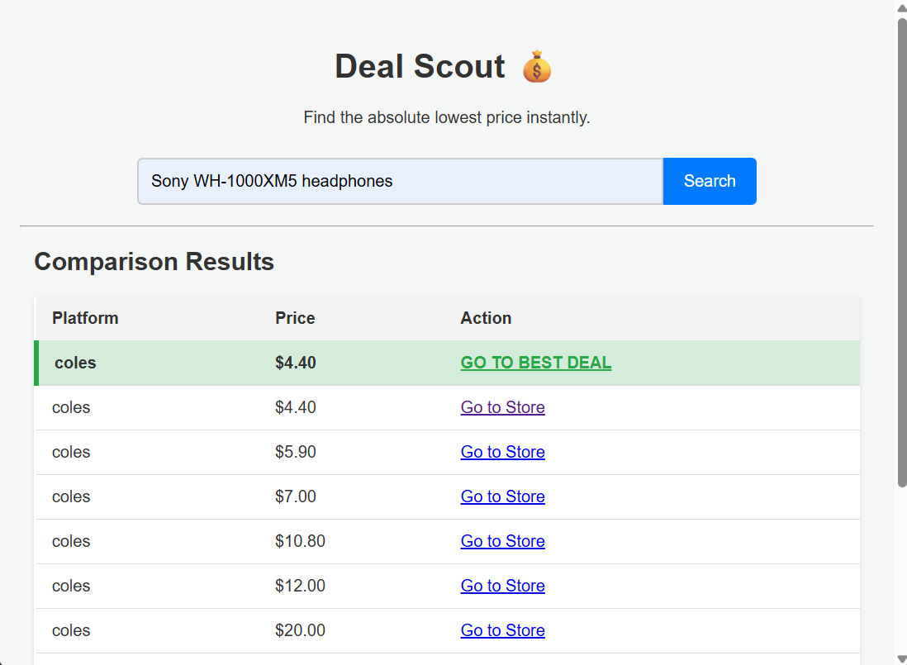

# 🛍️ Deal Scout: Real-Time Price Comparison Tool

**Deal Scout** is a web application built with Flask (Python) and plain JavaScript that helps users find the absolute lowest price for a product by comparing data scraped or retrieved from multiple e-commerce APIs in real-time. The application monetizes traffic by automatically generating affiliate links for the best deals.

---
## ✨ Live Demo

 
---

## ✨ Features

* **Real-Time Price Comparison:** Fetches live pricing data from external retailer APIs (e.g., Coles, Best Buy, etc.).
* **Best Deal Highlight:** Automatically sorts results and visually highlights the lowest-priced item.
* **Affiliate Link Generation:** Dynamically creates monetized outbound links using a stored affiliate ID (`YOUR_AFFILIATE_ID_123`).
* **Clean Architecture:** Separates application logic (Python class) from presentation logic (Flask routes and Jinja templates).
* **Secure Secrets Management:** Uses the `os` library to securely load API keys from environment variables.

---

## 🛠️ Core Technologies & Development Environment

| Category | Tool / Language | Notes |
| :--- | :--- | :--- |
| **Development Platform** | **Replit** | The primary cloud-based IDE used for coding and deployment environment. |
| **AI Assistant** | **Gemini** | Utilized for architectural guidance, debugging, and code generation during the development process. |
| **Backend** | Python 3 + Flask | The main framework for the API and server logic. |
| **HTTP Requests** | Python `requests` library | Used to communicate with external price comparison APIs. |
| **Frontend** | HTML5, CSS3, Vanilla JavaScript | Used for the user interface and handling asynchronous search requests. |

---

## 🚀 How to Run Locally

### Prerequisites

1.  **Python 3.8+**
2.  **Required Libraries:**
    ```bash
    pip install Flask requests
    ```
3.  **API Keys:** You must subscribe to price comparison APIs (e.g., on RapidAPI, DataYuge, etc.) to get your API Key and Endpoint URL.

### Setup and Configuration

1.  **Clone the Repository:**
    ```bash
    git clone [YOUR_REPO_URL]
    cd deal-scout-app
    ```

2.  **Set Environment Secrets:**
    For security, the application reads API keys from your environment. **You MUST set these variables:**

    * `RAPIDAPI_KEY_COLES` (For the Coles price API)
    * `RAPIDAPI_KEY_BESTBUY` (For any additional APIs you integrate)
    * Set these in your environment variables (or a `.env` file if using a local host).

3.  **Update API Configuration:**
    Open `main.py` and modify the `self.API_CONFIGS` list inside the `PriceScout` class with the exact URLs, search parameter keys, and price/link keys required by your chosen APIs.

4.  **Run the Application:**
    ```bash
    python main.py
    ```
    The application will run on `http://0.0.0.0:8080` (or `http://127.0.0.1:8080`).

---

## 🗂️ Project Structure

The file hierarchy follows the standard Flask convention:

```text
deal-scout-app/
├── main.py                # Core Python/Flask application logic, PriceScout class, and routes.
├── templates/
│   └── index.html         # The main search page HTML (Jinja template).
├── README.md              # Project documentation
└── static/
    ├── style.css          # Styling for the application.
    └── script.js          # JavaScript for handling search input, calling /api/search, and rendering the results table.
```
## 🤝 Contribution

Contributions are welcome! If you have suggestions for new features, bug fixes, or new API integrations (especially for different retail segments), please feel free to open an issue or submit a pull request.

---

## 📜 License

This project is licensed under the MIT License - see the LICENSE.md file for details.


